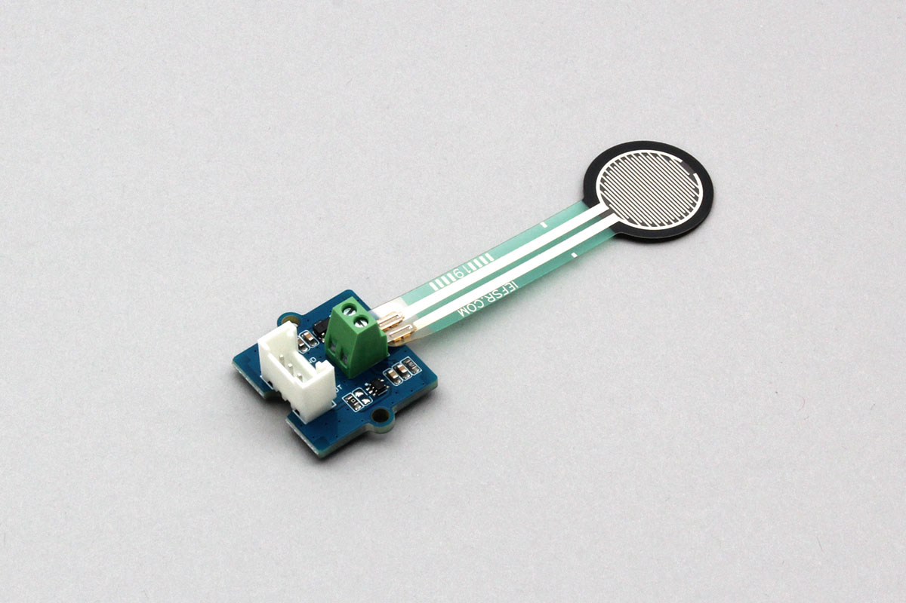

# Grove_PressureSensor
Groveコネクタで利用できる圧力センサです。  
センサで取得した圧力を0〜330(500)の間で返します。



## wired(obniz, {[output, vcc, gnd, grove]});
obnizデバイスと接続します。  
黄線、赤線、黒線がそれぞれoutput、vcc、gndに対応します。

name | type | required | default | description
--- | --- | --- | --- | ---
vcc | `number(obniz Board io)` | no |  &nbsp; | モジュールの場合はvcc, 単体の場合はHに接続します。別の電源につないでいる場合は指定する必要はありません。
gnd | `number(obniz Board io)` | no |  &nbsp; | モジュールの場合はgnd, 単体の場合はHに接続します。別の電源につないでいる場合は指定する必要はありません。
output | `number(obniz Board io)` | no |  &nbsp; | output 出力端子
grove | `object` | no | &nbsp;  | 接続するデバイスにgroveがある場合に利用できます

```Javascript
// Javascript Example
let sensor = obniz.wired("Grove_PressureSensor", {gnd:0, vcc:1, output: 3});
```

groveを持つデバイスでは、パラメータに{grove: obniz.grove0}を指定することで接続できます。
```javascript
// Javascript Example
let sensor = obniz.wired("Grove_PressureSensor", {grove: obniz.grove0});
```

## onchange = function(value){}
圧力センサの値に変化があった場合にcallback関数を呼び出します。

```javascript
// Javascript Example
let sensor = obniz.wired("Grove_PressureSensor", {grove: obniz.grove0});
sensor.onchange = function(value){
  console.log(value)
};
```

## [await]getWait();
圧力センサの値を一度だけ取得します。

```javascript
// Javascript Example
let sensor = obniz.wired("Grove_PressureSensor", {grove: obniz.grove0});
let value = await sensor.getWait();
console.log(value);
```
