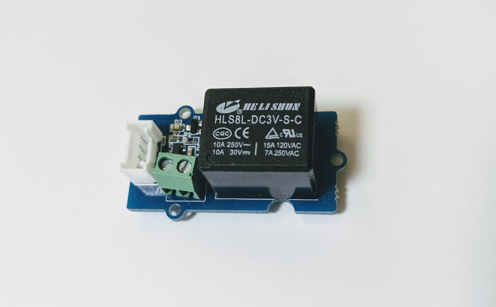
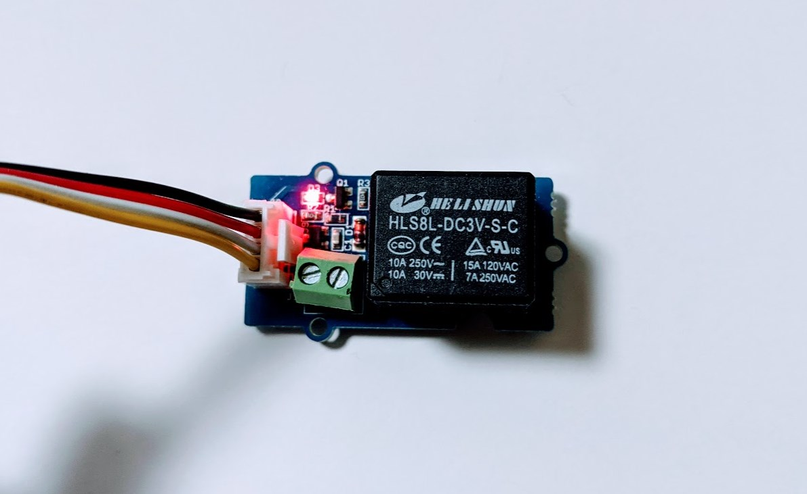

# Grove Relay



## wired(obniz,  { signal [, vcc, gnd, grove]});

name | type | required | default | description
--- | --- | --- | --- | ---
signal | `number(obniz Board io)` | yes |  &nbsp; | signal ボタンの状態を示す端子(4 pin of Grove)
vcc | `number(obniz Board io)` | no |  &nbsp; | VCC端子(2 pin of Grove)
gnd | `number(obniz Board io)` | no |  &nbsp; | GND端子(0 pin of Grove)
grove | `object` | no | &nbsp;  | 接続するデバイスにgroveがある場合に利用できます

```Javascript
// Javascript Example
var grove_relay = obniz.wired("Grove_Relay", {gnd:0, vcc:1, signal:3});
```

groveを持つデバイスでは、パラメータに{grove: obniz.grove0}を指定することで接続できます。

```Javascript
// Javascript Example
var grove_relay = obniz.wired("Grove_Relay", {grove: obniz.grove0});
``` 

### Grove と obniz の接続例


Grove 4ピンコネクタ-ジャンパーピン変換ケーブルという、黒・赤・白・黄で構成された 4 つのオスピンのジャンパーピンとGrove 4 つのメスピンの変換ケーブルを使用した例です。


まず、Grove ケーブルと Grove パーツをつなぎ、Grove と obniz はケーブルの色と obniz ピンが対応して差し込みます。

Grove ケーブル色 | obniz ピン | 機能 |
--- | --- | --- |
黒 | 0 | gnd |
赤 | 1 | vcc |
白 | 2 | -- |
黄 | 3 | signal |

この場合、接続する `obniz.wired` は、このように指定します。

```Javascript
// Javascript Example
var grove_relay = obniz.wired("Grove_Relay", {gnd:0, vcc:1, signal:3});
```

## on()

Grove リレーをオンにします。

```Javascript
// Javascript Example
var grove_relay = obniz.wired("Grove_Relay", {gnd:0, vcc:1, signal:3});
grove_relay.on();
```

正しく実行されると Grove リレーの内蔵 LED が点灯してをオンを知らせます。



## off()

Grove リレーをオフにします。

```Javascript
// Javascript Example
var grove_relay = obniz.wired("Grove_Relay", {gnd:0, vcc:1, signal:3});
grove_relay.off();
```