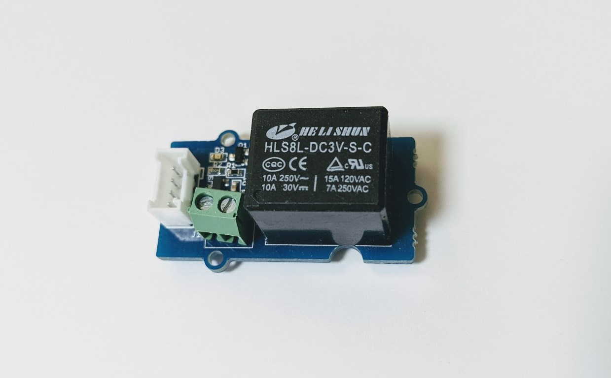
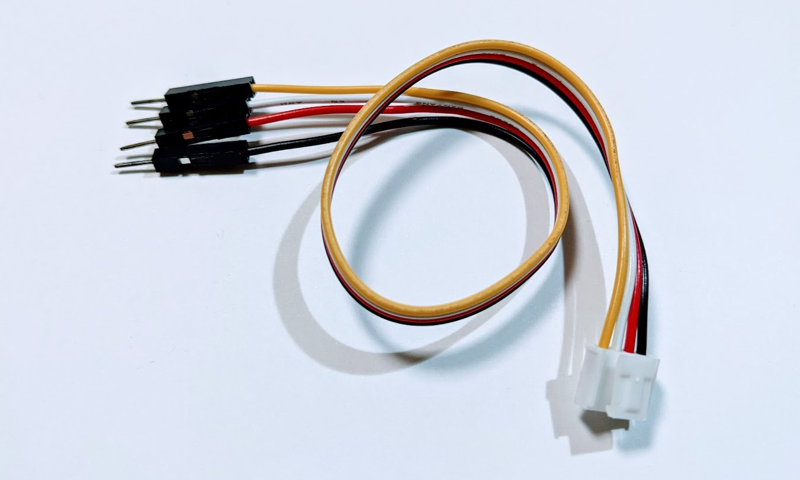
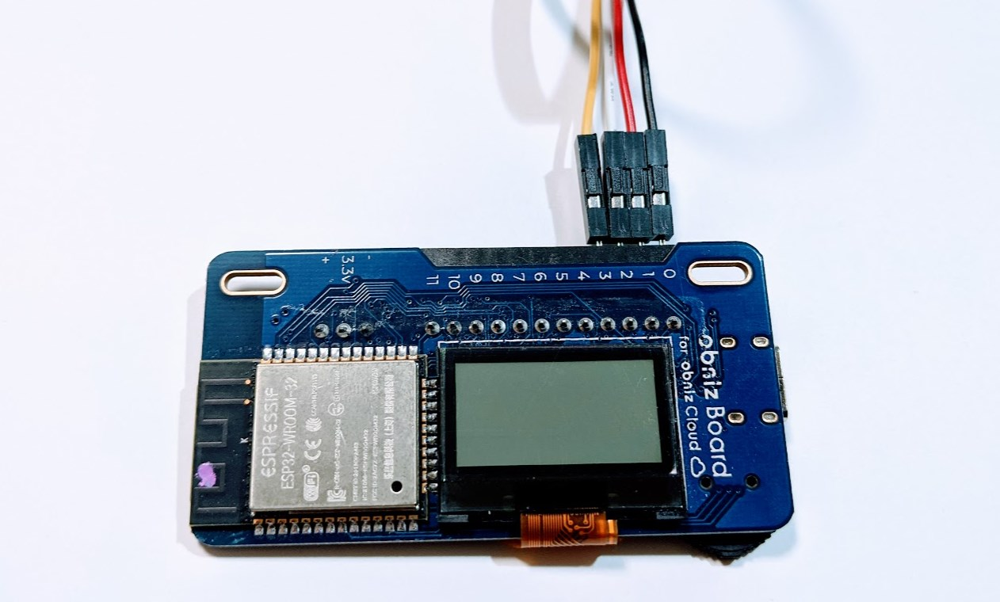
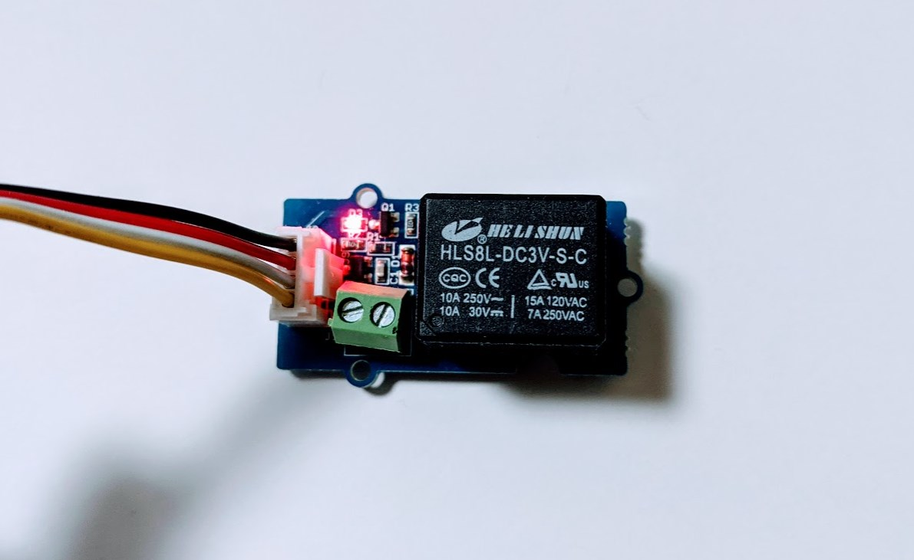

# Grove Relay



## wired(obniz,  { signal [, vcc, gnd, grove]});

name | type | required | default | description
--- | --- | --- | --- | ---
signal | `number(obniz Board io)` | yes |  &nbsp; | Signal pin of state output(4 pin of Grove)
vcc | `number(obniz Board io)` | no |  &nbsp; | VCC for button(2 pin of Grove)
gnd | `number(obniz Board io)` | no |  &nbsp; | GND for button(0 pin of Grove)
grove | `object` | no | &nbsp;  | grove interface object if a device has

```Javascript
// Javascript Example
var grove_relay = obniz.wired("Grove_Relay", {gnd:0, vcc:1, signal: 3});
```

If the device has a grove interface, it can be connected with just the parameter {grove: obniz.grove0}.

```Javascript
// Javascript Example
var grove_relay = obniz.wired("Grove_Relay", {grove: obniz.grove0});
```

### Grove cable and obniz の接続例



This example used "Grove 4 pin Female Jumper to Grove 4 pin Conversion Cable" composed of black, red, white, yellow pin cables and Grove connector.



Connect the Grove cable Grove parts. Connect the color of each the Grove cables to the obniz pins.

Grove cable color | obniz pin | function |
--- | --- | --- |
black | 0 | gnd |
red | 1 | vcc |
white | 2 | -- |
yellow | 3 | signal |

In this case, `obniz.wired` set like this.

```Javascript
// Javascript Example
var grove_relay = obniz.wired("Grove_Relay", {gnd:0, vcc:1, signal:3});
```

## on()

Turning on a Grove Relay.

```Javascript
// Javascript Example
var grove_relay = obniz.wired("Grove_Relay", {gnd:0, vcc:1, signal: 3});
grove_relay.on();
```

It inform using build-in LED when this was execuled correctly.



## off()

Turning off a Grove Relay.

```Javascript
// Javascript Example
var grove_relay = obniz.wired("Grove_Relay", {gnd:0, vcc:1, signal: 3});
grove_relay.off();
```
