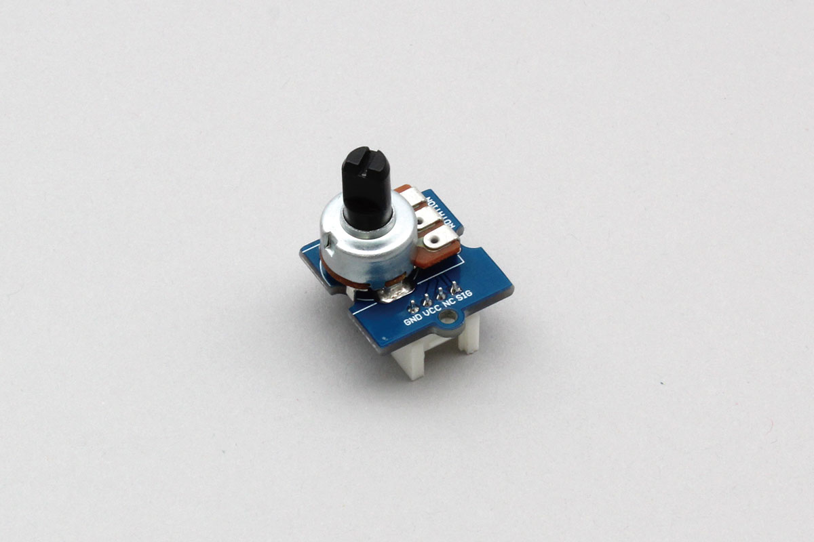

# Grove_RotaryAngleSensor
Potention Meter that can be used with Grove connectors.
Potention Meter change it's resistor value regarding angle or position.
obniz Board can read resistor value by using AD.
It has three pins. between sides resistor values is constant. voltage of center pin moves within left and right side's voltage.





This parts can treat only 10 ohm to 10 k ohm.

## wired(obniz, {[signal, vcc, gnd, grove]})

name | type | required | default | description
--- | --- | --- | --- | ---
signal | `number(obniz Board io)` | yes |  &nbsp; | signal (4 pin of Grove)
vcc | `number(obniz Board io)` | no |  &nbsp; | VCC(2 pin of Grove)
gnd | `number(obniz Board io)` | no |  &nbsp; | GND(0 pin of Grove)
grove | `object` | no | &nbsp;  | grove interface object if a device has

```Javascript
// Javascript Example
const meter = obniz.wired("Grove_RotaryAngleSensor", {gnd:0, vcc:1, signal: 3});
```
  
If the device has a grove interface, it can be connected with just the parameter {grove: obniz.grove0}.
```Javascript
// Javascript Example
const meter = obniz.wired("Grove_RotaryAngleSensor", {grove: obniz.grove0});
```

## onchange 
Called when rotated.
Position value return a resistor value.
A value of 0.0 to 3.3 (5.0) is returned according to the rotation.
```Javascript
// Javascript Example
const meter = obniz.wired("Grove_RotaryAngleSensor", {grove: obniz.grove0});
meter.onchange = function(position) {
  console.log("position: " + position);
};
```