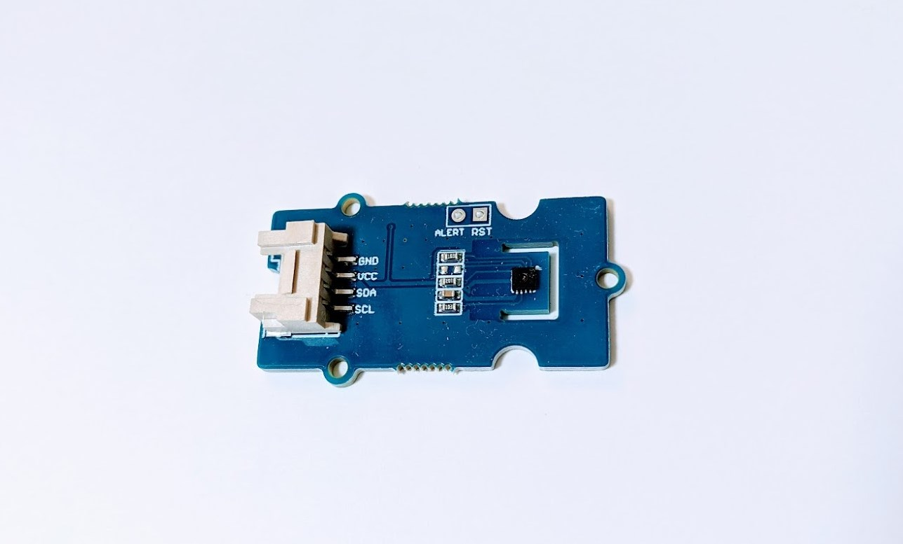

# Grove - I2C High Accuracy Temp&Humi Sensor(SHT35)

Library for Grove I2C High Accuracy Temp&Humi Sensor(SHT35) module.

[Grove I2C High Accuracy Temp&Humi Sensor(SHT35)](https://wiki.seeedstudio.com/Grove-I2C_High_Accuracy_Temp&Humi_Sensor-SHT35/).



## wired(scl, sda {, vcc, gnd, grove})

Connect pins to an obniz Board.

| grove | cable | obniz |
|:--:|:--:|:--:|
| scl | - | scl |
| sda | - | sda |
| vcc | - | vcc |
| gnd | - | gnd |

```javascript
// Javascript Example
var Grove_SHT35Sensor = obniz.wired("Grove_SHT35Sensor", { gnd:0 , vcc:1 , sda:2 , scl:3 });
```

If the device has a grove interface, it can be connected with just the parameter {grove: obniz.grove0}.
```javascript
// Javascript Example
var Grove_SHT35Sensor = obniz.wired("Grove_SHT35Sensor", { grove: obniz.grove0 });
```

## [await] getAllWait()

get all values.

- temperature: celcius
- humidity: %

```javascript
// Javascript Example
var Grove_SHT35Sensor = obniz.wired("Grove_SHT35Sensor", { gnd:0 , vcc:1 , sda:2 , scl:3 });
const datas = await Grove_SHT35Sensor.getAllWait();
console.log('temp: ' + datas.temperature + ' degree');
console.log('humidity: ' + datas.humidity + ' %');
```
