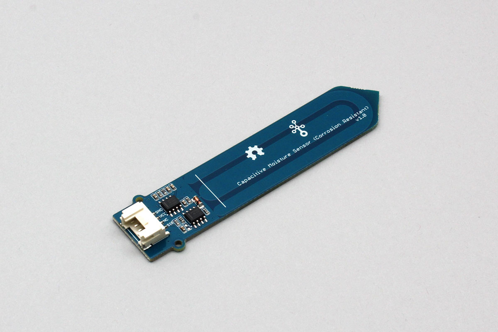

# Grove_SoilMoistureSensor

A soil humidity sensor that can be used with Grove connectors. You can get the humidity of the soil.  
The returned value ranges from 0 to voltage, and the higher the humidity, the lower the value (closer to 0).



## wired(obniz, {[signal, vcc, gnd, grove]});

Connect to the obniz device.  
Yellow, red and black wires correspond to signal, vcc and gnd respectively.

name | type | required | default | description
--- | --- | --- | --- | ---
vcc | `number(obniz Board io)` | no |  &nbsp; | Power Supply
gnd | `number(obniz Board io)` | no |  &nbsp; | Power Supply
signal | `number(obniz Board iov)` | no |  &nbsp; | signal output pin
grove | `object` | no | &nbsp;  | grove interface object if a device has

```Javascript
// Javascript Example
let sensor = obniz.wired("Grove_SoilMoistureSensor", {gnd:0, vcc:1, signal: 3});
```

If the device has a grove interface, it can be connected with just the parameter {grove: obniz.grove0}.
```javascript
// Javascript Example
let sensor = obniz.wired("Grove_SoilMoistureSensor", {grove: obniz.grove0});
```

## onchange(value)
Callback function called when the value was changed.

```javascript
// Javascript Example
let sensor = obniz.wired("Grove_SoilMoistureSensor", {grove: obniz.grove0});
sensor.onchange = function(value){
  console.log(value)
};
```
## [await] getWait()
Measure and get current value once.

```javascript
// Javascript Example
let sensor = obniz.wired("Grove_SoilMoistureSensor", {grove: obniz.grove0});
let value = await sensor.getWait();
console.log('Humidity Level:' + value);
```
