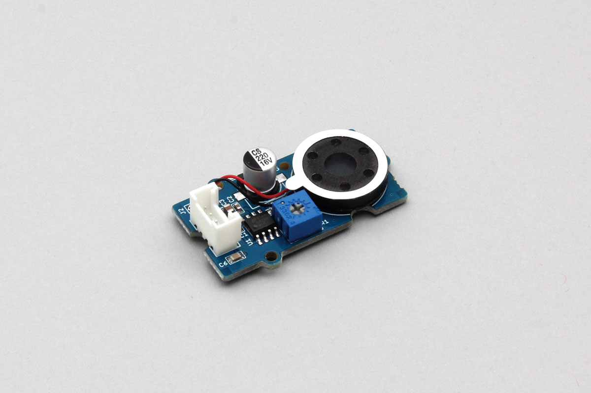

# Grove_Speaker

Speaker can be used with Grove connectors.   
Play a sound of the specified frequency.  



## wired(obniz, {[signal, vcc, gnd, grove]});

Connect to the obniz device.  
Yellow, red and black wires correspond to signal, vcc and gnd respectively.  

name | type | required | default | description
--- | --- | --- | --- | ---
vcc | `number(obniz Board io)` | no |  &nbsp; | Power Supply
gnd | `number(obniz Board io)` | no |  &nbsp; | Power Supply
signal | `number(obniz Board iov)` | no |  &nbsp; | signal output pin
grove | `object` | no | &nbsp;  | grove interface object if a device has

```Javascript
// Javascript Example
const speaker = obniz.wired("Grove_Speaker", {gnd:0, vcc:1, signal: 3});
```

If the device has a grove interface, it can be connected with just the parameter {grove: obniz.grove0}.
```Javascript
// Javascript Example
const speaker = obniz.wired("Grove_Speaker", {grove: obniz.grove0})
```

## play(frequency)
It plays a sound of the specified frequency from the speaker.

```Javascript
// Javascript Example
const speaker = obniz.wired("Grove_Speaker", {grove: obniz.grove0})
speaker.play(1000); //1000hz
```

## stop()
Stop playing.

```Javascript
// Javascript Example
const speaker = obniz.wired("Grove_Speaker", {grove: obniz.grove0})
speaker.play(1000); //1000hz
await obniz.wait(1000);
speaker.stop();
```

