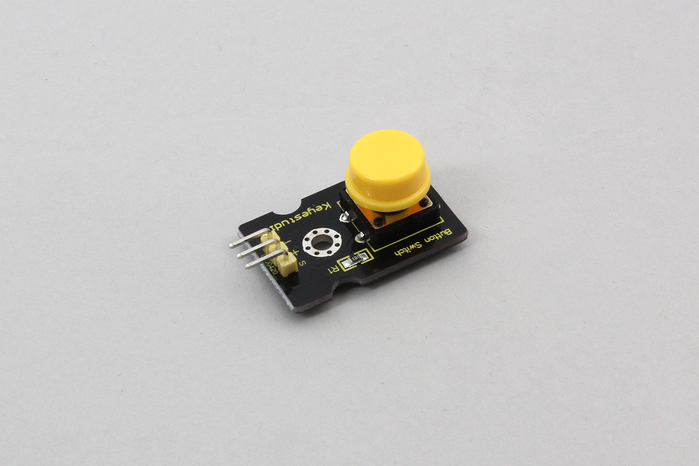

# Keyestudio_Button

Keyestudio button module.



## wired(obniz,  { signal [, vcc, gnd]});


name | type | required | default | description
--- | --- | --- | --- | ---
signal | `number(obniz Board io)` | yes |  &nbsp; | Signal pin of state output(s pin of Keyestudio)
vcc | `number(obniz Board io)` | no |  &nbsp; | VCC for button(+ pin of Keyestudio)
gnd | `number(obniz Board io)` | no |  &nbsp; | GND for button(- pin of Keyestudio)


```Javascript
// Javascript Example
var button = obniz.wired("Keyestudio_Button", {signal:0, vcc:1, gnd:2});
button.onchange = function(voltage) {
  console.log(voltage);
}
```

## onchange = function(pressed){}
called when button pressed/released.

```Javascript
// Javascript Example
var button = obniz.wired("Keyestudio_Button", {signal:0, vcc:1, gnd:2});
button.onchange = function(pressed){
  console.log("pressed:" + pressed)
};
```

## [await] isPressedWait()
Check current button with waiting result.
```Javascript
// Javascript Example
var button = obniz.wired("Keyestudio_Button", {signal:0, vcc:1, gnd:2});
var pressed = await button.isPressedWait();
console.log("Pressed = " + pressed);
```


## [await] stateWait()
Wait until push/release button.
```Javascript
// Javascript Example
var button = obniz.wired("Keyestudio_Button", {signal:0, vcc:1, gnd:2});
await button.stateWait(false); 
console.log("button pushed!");
await button.stateWait(true); 
console.log("button released");
```
