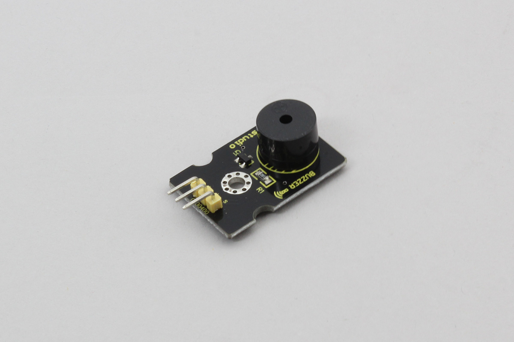

# Keyestudio_Buzzer

Keyestudio社製ブザーです。指定した高さの音を鳴らすことができます。



## wired(obniz,  {signal [, vcc, gnd]})


name | type | required | default | description
--- | --- | --- | --- | ---
signal | `number(obniz Board io)` | yes |  &nbsp; | signal 出力端子(s pin of Keyestudio)
vcc | `number(obniz Board io)` | no |  &nbsp; | VCC端子(+ pin of Keyestudio)
gnd | `number(obniz Board io)` | no |  &nbsp; | GND端子(- pin of Keyestudio)


```Javascript
// Javascript Example
var speaker = obniz.wired("Keyestudio_Buzzer", {signal:0, vcc:1, gnd:2});
speaker.play(1000) // 1000 Hz
```

## play(frequency)

スピーカーから指定した周波数の音を鳴らします

```Javascript
// Javascript Example
var speaker = obniz.wired("Keyestudio_Buzzer", {signal:0, vcc:1, gnd:2});
speaker.play(1000) // 1000 Hz
```

## stop()

再生を停止します。

```Javascript
// Javascript Example
var speaker = obniz.wired("Keyestudio_Buzzer", {signal:0, vcc:1, gnd:2});
speaker.play(1000) // 1000 Hz
await obniz.wait(1000);
speaker.stop();
```
