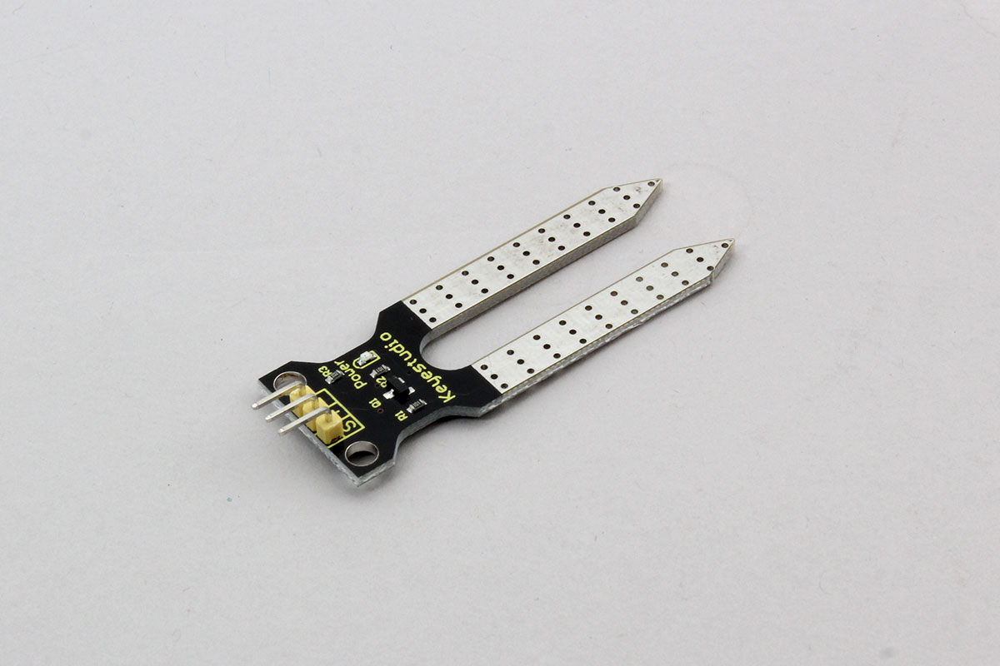

# Keyestudio_MoistureSensor



Keyestudio soil humitidy sensor module. It detect moisture level in soil.  
Manufacture data says moisture level increse with moisture like:

- 0~1.47: Dry
- 1.47~3.43: Wet
- 3.43~4.20: Under water

## wired(obniz, {signal [, vcc, gnd]})

name | type | required | default | description
--- | --- | --- | --- | ---
signal | `number(obniz Board io)` | yes |  &nbsp; | pin outputs a sensor value(s pin of Keyestudio)
vcc | `number(obniz Board io)` | no |  &nbsp; | VCC for sensor(+ pin of Keyestudio)
gnd | `number(obniz Board io)` | no |  &nbsp; | GND for sensor(- pin of Keyestudio)


```javascript
// Javascript Example
var sensor = obniz.wired("Keyestudio_MoistureSensor", {signal:0, vcc:1, gnd:2});
```


## onchange = function(value)
callback function called when the value was changed.


```javascript
// Javascript Example
var sensor = obniz.wired("Keyestudio_MoistureSensor", {signal:0, vcc:1, gnd:2});
sensor.onchange = function(value){
  console.log(value)
};
```

## [await] getHumidityWait()
Measure and get current value once.

```javascript
// Javascript Example
var sensor = obniz.wired("Keyestudio_MoistureSensor", {signal:0, vcc:1, gnd:2});
var value = await sensor.getHumidityWait();
console.log('Humidity Level:' + value);
```
