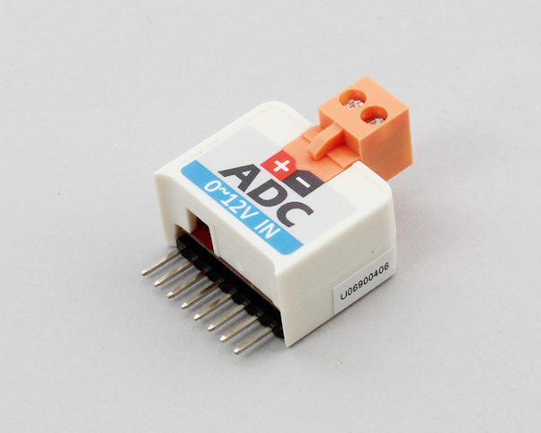

# StickC_ADC

M5StickC用ADコンバータです。+と-の間の電位差を読み取ります。 
0~12vまでを計測することができます。

[https://m5stack.com/products/m5stickc-adc-hat-ads1100](https://m5stack.com/products/m5stickc-adc-hat-ads1100)



## wired(obniz, {[scl, sda, vcc, gnd, i2c]})
obnizデバイスと接続します。  
もしM5StickCを使用している場合、ピン指定を省略することができます。

```javascript
// JavaScript Examples
var adc = obniz.wired("M5StickC_ADC");
while(true) {
  var vol = await adc.getVoltageWait();
  console.log(vol + " V");
  await obniz.wait(1);
}
```

他のデバイスの場合には、下記のようにピンを指定してください。

name | type | required | default | description
--- | --- | --- | --- | ---
vcc | `number(obniz Board io)` | no |  &nbsp; | モジュールの場合はvcc, 単体の場合はHに接続します。別の電源につないでいる場合は指定する必要はありません。
gnd | `number(obniz Board io)` | no |  &nbsp; | モジュールの場合はgnd, 単体の場合はHに接続します。別の電源につないでいる場合は指定する必要はありません。
scl | `number(obniz Board io)` | no |  &nbsp; | I2Cのsclとなる端子です
sda | `number(obniz Board io)` | no | &nbsp;  | I2Cのsdaとなる端子です
i2c | `object` | no | &nbsp;  | obnizのi2cオブジェクトです

```javascript
// JavaScript Examples
var adc = obniz.wired("M5StickC_ADC", {sda:0, scl:26});
while(true) {
  var vol = await adc.getVoltageWait();
  console.log(vol + " V");
  await obniz.wait(1);
}
```


## setGain(number)

ゲインを設定します。1(default),2,4,8倍から選択できます。

```javascript
// JavaScript Examples
var adc = obniz.wired("M5StickC_ADC", {sda:0, scl:26});
adc.setGain(1);
while(true) {
  var vol = await adc.getVoltageWait();
  console.log(vol + " V");
  await obniz.wait(1);
}
```


## [await] getVoltageWait()

読み取った電位差(V)を取得します。

```javascript
// JavaScript Examples
var adc = obniz.wired("M5StickC_ADC", {sda:0, scl:26});
while(true) {
  var vol = await adc.getVoltageWait();
  console.log(vol + " V");
  await obniz.wait(1);
}
```