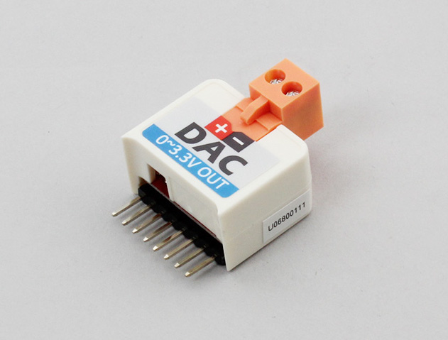

# M5StickC_DAC

M5StickC用DAコンバータです。+と-の間に電位差を作り出します。

[https://m5stack.com/products/m5stickc-adc-hat-ads1100](https://m5stack.com/products/m5stickc-adc-hat-ads1100)



## wired(obniz, {[scl, sda, vcc, gnd, i2c]})
obnizデバイスと接続します。  
もしM5StickCを使用している場合、ピン指定を省略することができます。


```javascript
// JavaScript Examples
var dac = obniz.wired("M5StickC_DAC");
dac.setVoltage(1.5);
```


その他のデバイス場合には，下記のようにピンを指定してください． 

name | type | required | default | description
--- | --- | --- | --- | ---
vcc | `number(obniz Board io)` | no |  &nbsp; | モジュールの場合はvcc, 単体の場合はHに接続します。別の電源につないでいる場合は指定する必要はありません。
gnd | `number(obniz Board io)` | no |  &nbsp; | モジュールの場合はgnd, 単体の場合はHに接続します。別の電源につないでいる場合は指定する必要はありません。
scl | `number(obniz Board io)` | no |  &nbsp; | I2Cのsclとなる端子です
sda | `number(obniz Board io)` | no | &nbsp;  | I2Cのsdaとなる端子です
i2c | `object` | no | &nbsp;  | obnizのi2cオブジェクトです

```javascript
// JavaScript Examples
var dac = obniz.wired("M5StickC_DAC", {sda:0, scl:26});
dac.setVoltage(1.5);
```

## setVoltage(voltage)
指定した電位差を作り出します。  
0~3.3(mV)の間の値を指定してください。  

```javascript
// JavaScript Examples
var dac = obniz.wired("M5StickC_DAC", {sda:0, scl:26});
dac.setVoltage(1.5);
```