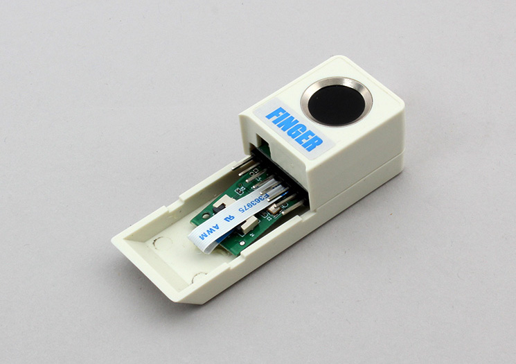

# M5StickC_FINGER

指紋センサF1020SCを内蔵するStickC用指紋認証モジュールです。  
モジュール単体で指紋の登録、削除、一致確認ができ、セキュリティ向上に役立ちます。




## wired(obniz, {tx, rx, gnd})
obnizデバイスと接続します。  


もしM5StickCを使用している場合、ピン指定を省略することができます。

```javascript
// JavaScript Examples
var sensor = obniz.wired("M5StickC_FINGER");
```

その他のデバイスの場合は、ux,rxを指定してください

name | type | required | default | description
--- | --- | --- | --- | ---
tx | `number(obniz Board io)` | yes |  &nbsp; | uartのtxとなる端子です
rx | `number(obniz Board io)` | yes | &nbsp;  | uartのrxとなる端子です
gnd | `number(obniz Board io)` | no | &nbsp;  | gndとなる端子です

```javascript
// JavaScript Examples
var sensor = obniz.wired("M5StickC_FINGER", {tx:0, rx:26});
```


以下の一部の関数は返り値として`ACK`を返します。
`ACK`には以下の種類があります。  
ACK |内容 |意味 
---|---|---
`SUCCESS` |`0x00` |実行に成功しました
`FULL` |`0x04` |内部データが満杯です
`NOUSER` |`0x05` |合致する指紋データが存在しません
`USER_EXIST` |`0x07` |既に登録済みの指紋です
`TIMEOUT` |`0x08` |通信がタイムアウトしました

これらの値には以下のようにアクセスできます。
```javascript
// JavaScript Examples
var sensor = obniz.wired("M5StickC_FINGER", {tx:0, rx:26});
console.log(sensor.ack.SUCCESS); // 0
```


## [await] getUserNumWait()
モジュールに登録されている指紋の数を一度だけ取得します。  
取得に失敗した際は`255(0xFF)`が返却されます。  

```javascript
// JavaScript Examples
var sensor = obniz.wired("M5StickC_FINGER", {tx:0, rx:26});
var userNum = await sensor.getUserNumWait();
console.log("userNum: " + userNum);
```

## [await] addUserWait(userNum, userPermission)
センサで読み取った指紋をモジュールに追加します。  
指紋の有効性を高めるため、関数内部で3度指紋を読み取ります。そのため、実行に時間がかかります。  
`userNum`には`getUserNumWait()`で取得した値を渡してください。  
`userPermission`には`1~3`の整数を入れてください。ユーザ権限としてモジュール内に登録されますが、数値の意味は開発者が定義します。  
返り値は`ACK`のうち`SUCCESS`、`TIMEOUT`のいずれかです。

```javascript
// JavaScript Examples
var sensor = obniz.wired("M5StickC_FINGER", {tx:0, rx:26});
var userNum = await sensor.getUserNumWait();
console.log("userNum: " + userNum);
var res = await sensor.addUserWait(userNum, 1);
if (res == sensor.ack.SUCCESS) {
    console.log("successfully registered.")
}
```

## [await] deleteUserWait(userNum)
指定した指紋をモジュールから削除します。  
引数`userNum`によって指紋を指定してください。  
成功するとACK`SUCCESS`を返します。

```javascript
// JavaScript Examples
var sensor = obniz.wired("M5StickC_FINGER", {tx:0, rx:26});
await sensor.deleteUserWait(0);
if (res == sensor.ack.SUCCESS) {
    console.log("fingerprint " + 0 + " was successfully deleted.");
}
```

## [await] deleteAllUserWait()
モジュールに登録してある全ての指紋を削除します。  
成功するとACK`SUCCESS`を返します。

```javascript
// JavaScript Examples
var sensor = obniz.wired("M5StickC_FINGER", {tx:0, rx:26});
await sensor.deleteAllUserWait();
if (res == sensor.ack.SUCCESS) {
    console.log("all fingerprints were successfully deleted.");
}
```

## [await] compareFingerWait()
センサで読み取った指紋がモジュールに登録してある指紋のいずれかに合致するかどうか比べます。  
合致する指紋があった場合、ユーザ権限`1~3`を返します。
合致する指紋がなかった場合は`ACK`のうち`NOUSER`、`TIMEOUT`のいずれかを返します。

```javascript
// JavaScript Examples
var sensor = obniz.wired("M5StickC_FINGER", {tx:0, rx:26});
var res = await compareFingerWait();
if (res == 1 || res == 2 || res == 3) {
    console.log("you are registered user. welcome!");
}
```

## [await] getUserPermissionWait(userNum)
指定した指紋のユーザ権限を取得します。  
引数`userNUm`によって指紋を指定してください。  
ユーザ権限`1~3`を返します。  

```javascript
// JavaScript Examples
var sensor = obniz.wired("M5StickC_FINGER", {tx:0, rx:26});
var perm = await getUserPermissionWait(0)
console.log("user permission: " + perm);
```

## [await] setAddModeWait(mode)
このモジュールには2つの指紋追加モードがあります。  
同じ指紋を何度でも追加できる「重複許可モード(`0`)」と、重複した指紋の追加を禁止する「重複禁止モード(`1`)」の2つです。デフォルトでは重複禁止モードになっています。  
この関数では、`mode`引数に`0`か`1`を指定することで指紋追加モードを変更できます。  
成功するとACK`SUCCESS`を返します。

```javascript
// JavaScript Examples
var sensor = obniz.wired("M5StickC_FINGER", {tx:0, rx:26});
sensor.setAddModeWait(0);
```

## [await] readAddModeWait()
現在の指紋追加モードを取得できます。  
重複許可モードを表す`0`か、重複禁止モードを表す`1`を返します。

```javascript
// JavaScript Examples
var sensor = obniz.wired("M5StickC_FINGER", {tx:0, rx:26});
var mode = sensor.readAddModeWait();
console.log("mode: " + mode);
```

## [await] setSecurityLevelWait(level)
このモジュールには`0~9`のセキュリティレベルが存在し、値が大きいほど指紋の比較が厳密になります。デフォルトレベルは`5`です。  
この関数では、`level`引数に`0~9`の整数を指定することでセキュリティレベルを変更できます。  
成功するとACK`SUCCESS`を返します。

```javascript
// JavaScript Examples
var sensor = obniz.wired("M5StickC_FINGER", {tx:0, rx:26});
sensor.setSecurityLevel(6);
```

## [await] readSecurityLevelWait()
現在のセキュリティレベルを取得できます。  
`0~9`の整数を返します。

```javascript
// JavaScript Examples
var sensor = obniz.wired("M5StickC_FINGER", {tx:0, rx:26});
var level = sensor.readSecurityLevelWait();
console.log("security level: " + level);
```

## [await] sleepWait()
モジュールをスリープ状態にします。  
成功するとACK`SUCCESS`を返します。  

```javascript
// JavaScript Examples
var sensor = obniz.wired("M5StickC_FINGER", {tx:0, rx:26});
sensor.sleepWait();
```