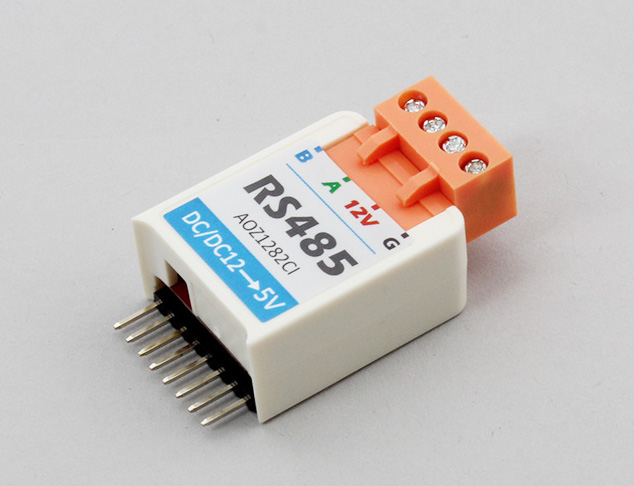

# M5StickC RS485

M5StickC用のRS485-HAT は RS485 converterです。



## wired(obniz, {tx, rx,{vcc, gnd, baud}})

もしM5StickCを使用している場合、ピン指定を省略することができます。

```javascript
var obniz = new Obniz.M5StickC("OBNIZ_ID_HERE");
obniz.onconnect = async function() {
  var rs485 = obniz.wired("M5StickC_RS485"); // M5stick C
}
```

その他のデバイスの場合は、下記のように指定してください。  

name | type | required | default | description
--- | --- | --- | --- | ---
vcc | `number(obniz Board io)` | no |  &nbsp; | Power Supply
gnd | `number(obniz Board io)` | no |  &nbsp; | Power Supply
tx | `number(obniz Board io)` | yes |  &nbsp; | tx
rx | `number(obniz Board io)` | yes | &nbsp;  | rx
baud | `number` | no | &nbsp;  | baudrate

```javascript
// Javascript Example
var rs485 = obniz.wired("M5StickC_RS485", {tx: 0, rx:26}); // M5stick C

rs485.onreceive = function(data, text) {
  console.log(text);
}
$("#send").click(function(){
  rs485.send("Hello")
})
```

## send(data)

RS485にデータを送信します。

```javascript
// Javascript Example
var rs485 = obniz.wired("M5StickC_RS485", {tx: 0, rx:26}); // M5stick C
rs485.send("Hello")
```

## onreceive(data, text)

RS485から受信したデータのコールバックになります。
uart.onreceive()と同様の仕様です。

```javascript
// Javascript Example
var rs485 = obniz.wired("M5StickC_RS485", {tx: 0, rx:26}); // M5stick C

rs485.onreceive = function(data, text) {
  console.log(text);
}
```
