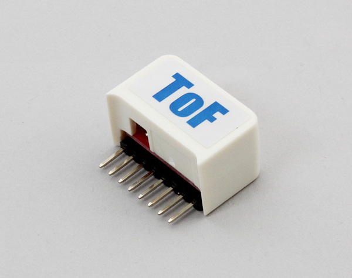

# M5StickC_ToF
The distance sensor for the M5StickC with built-in laser distance sensor VL53L0X.  

It measures 30mm~2000mm.



## wired(obniz, {[scl, sda, vcc, gnd, i2c]})
connect to the obniz Board.
When using M5StickC, You do not need to assign pins. 

```javascript
// JavaScript Examples
var sensor = obniz.wired("M5StickC_ToF");
var distance = await sensor.getWait();
console.log(distance);
```


When using other devices, assign vcc and gnd as appropriate pins.

name | type | required | default | description
--- | --- | --- | --- | ---
scl | `number(obniz Board io)` | no |  &nbsp; | scl of I2C
sda | `number(obniz Board io)` | no | &nbsp;  | sda of I2C
i2c | `object` | no | &nbsp;  | obniz i2c object

```javascript
// JavaScript Examples
var sensor = obniz.wired("M5StickC_ToF", {scl:26, sda:0});
var distance = await sensor.getWait();
console.log(distance);
```

## [await] getWait()
get the distance(mm) once.   

```javascript
// JavaScript Examples
var sensor = obniz.wired("M5StickC_ToF", {scl:26, sda:0});
var distance = await sensor.getWait();
console.log(distance);
```