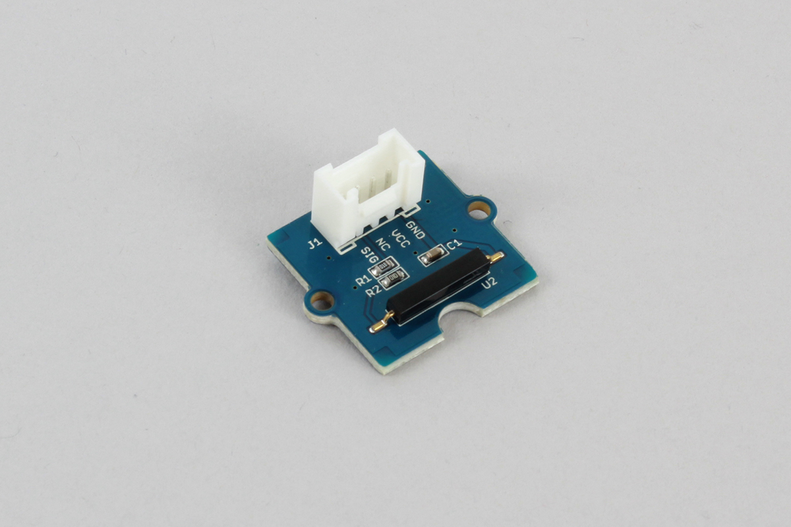

# CT10

Grove connectable magnet sensor.



## wired(obniz,  { signal [, vcc, gnd]});


name | type | required | default | description
--- | --- | --- | --- | ---
signal | `number(obniz Board io)` | yes |  &nbsp; | Signal pin of state output(4 pin of Grove)
vcc | `number(obniz Board io)` | no |  &nbsp; | VCC for ct10(2 pin of Grove)
gnd | `number(obniz Board io)` | no |  &nbsp; | GND for ct10(0 pin of Grove)


```Javascript
// Javascript Example
var ct10 = obniz.wired("CT10", {gnd:0, vcc:1, signal: 3});
ct10.onchange = function(voltage) {
  console.log(voltage);
}
```

## onchange = function(detect){}

called when ct10 detect/miss magnet field.

```Javascript
// Javascript Example
var ct10 = obniz.wired("CT10", {gnd:0, vcc:1, signal: 3});
ct10.onchange = function(detect){
  console.log("magnet field detect:" + detect)
};
```

## [await] isNearWait()

Check if powerful magnet field exist or not.

```Javascript
// Javascript Example
var ct10 = obniz.wired("CT10", {gnd:0, vcc:1, signal: 3});
var detect = await ct10.isNearWait();
console.log("exist = " + detect);
```


## [await] stateWait()

Wait until state change.

```Javascript
// Javascript Example
var ct10 = obniz.wired("CT10", {gnd:0, vcc:1, signal: 3});
await ct10.stateWait(true); 
console.log("ct10 detect magnet field!");
await ct10.stateWait(false); 
console.log("ct10 miss magnet field");
```