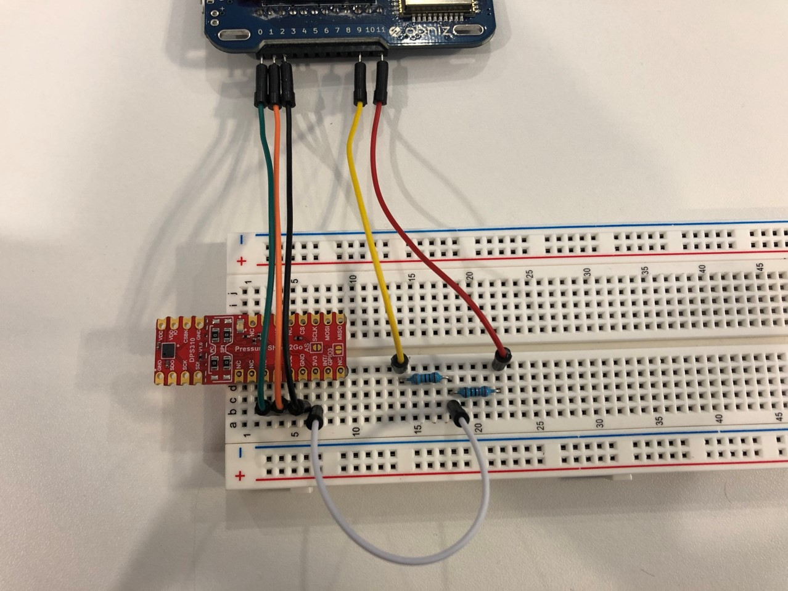

# Pressure Sensor - DPS310


## wired(obniz, {sda, scl, gnd})

Connect obniz Board and DPS310
It is necessary to devide the voltage so that it does not exceed the current specification.
Wiring diagram, as specified below:




```javascript
//JavaScript example
obniz.setVccGnd(11, 9, '5v'); //vcc:11, gnd:9
var sensor = obniz.wired("DPS310", { sda:0, scl:1, gnd:2 });
```


## [await] initWait();
Initialize DPS310.

```javascript
//JavaScript example
var sensor = obniz.wired("DPS310", { sda:0, scl:1, gnd:2 });
await sensor.initWait(); 
```

## [await] measurePressureOnceWait();
Get pressure value once.

```javascript
//JavaScript example
var sensor = obniz.wired("DPS310", { sda:0, scl:1, gnd:2 });
await sensor.initWait(); 
var data = await sensor.measurePressureOnceWait();
console.log(data);
```