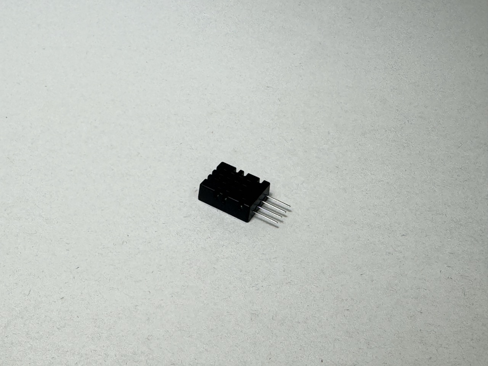

# Temperature Sensor - DHT20
温湿度センサDHT20です。センサで取得した温度を知ることができます。



## wired(obniz,  {vcc , sda, scl, gnd} )
obniz Boardに温度センサをつなぎます。

```javascript
// Javascript Example
let sensor = obniz.wired("DHT20",{vcc:0, sda:1, gnd:2,  scl:3});
```

## [await] getAllDataWait()
現在の温湿度を計測して返します。

```javascript
// Javascript Example
let device = obniz.wired("DHT20",{vcc:0, sda:1, gnd:2,  scl:3});

let data = await device.getAllDataWait();
console.log(data);
    
```


## [await] getTemperatureWait()
現在の温度を計測して返します。単位は摂氏(°C)です。

```javascript
// Javascript Example
let device = obniz.wired("DHT20",{vcc:0, sda:1, gnd:2,  scl:3});

let data = await device.getTemperatureWait();
console.log(data);
    
```

## [await] getHumidityWait()
現在の湿度を計測して返します。単位は%です。


```javascript
// Javascript Example
let device = obniz.wired("DHT20",{vcc:0, sda:1, gnd:2,  scl:3});

let data = await device.getHumidityWait();
console.log(data);
    
```
