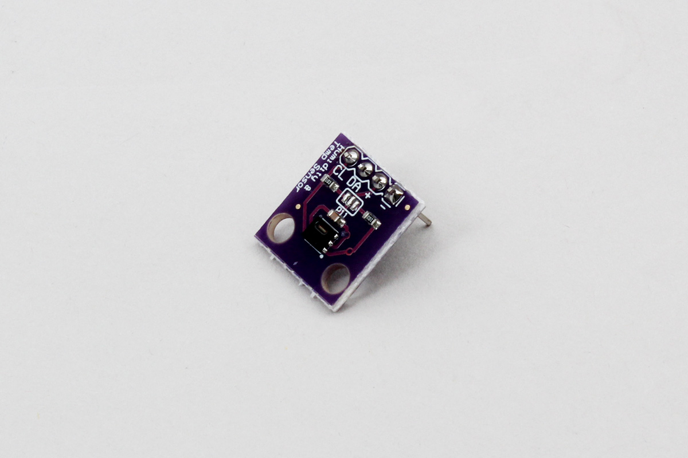

# Temperature Sensor - SHT20
Temperature and Humidity sensor SHT20



## wired(obniz,  {vcc , sda, scl, gnd} )

```javascript
// Javascript Example
var sensor = obniz.wired("SHT20", {vcc : 0, sda:1, scl:2, adr:3, gnd:4, addressmode:5});
```

## [await] getTempWait()
Get a temperature. Unit is Celsius.

```javascript
// Javascript Example
var sensor = obniz.wired("SHT20", {vcc : 0, sda:1, scl:2, adr:3, gnd:4, addressmode:5});
var temp = await sensor.getTempWait();
console.log('temperature:' + temp);
```

## [await] getHumidWait()
Get a Humidity. Unit is Ratio(%).
```javascript
// Javascript Example
var sensor = obniz.wired("SHT20", {vcc : 0, sda:1, scl:2, adr:3, gnd:4, addressmode:5});
var humd = await sensor.getHumidWait();
console.log('humidity:' + humd);
```
